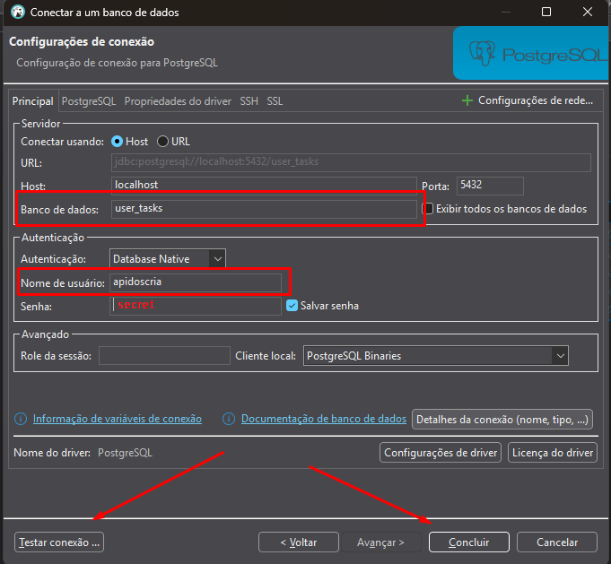

# Para executar o Dockerfile

* Precisa abrir um CMD dentro da pasta do repositório 

```
CD API_integracao_de_sistemas\DATABASE 
docker build -t bd_user_tasks .
docker run -p 5432:5432 --name=dk-bd_user_tasks bd_user_tasks 
```
## Configurando o DBeaver

* Clicar em "Nova conexão" ou `CTRL + SHIFT + N`
* Configurar **exatamente** igual a imagem abaixo:

    